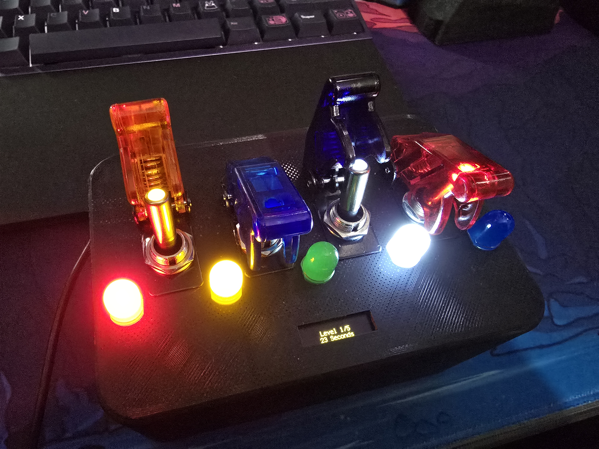
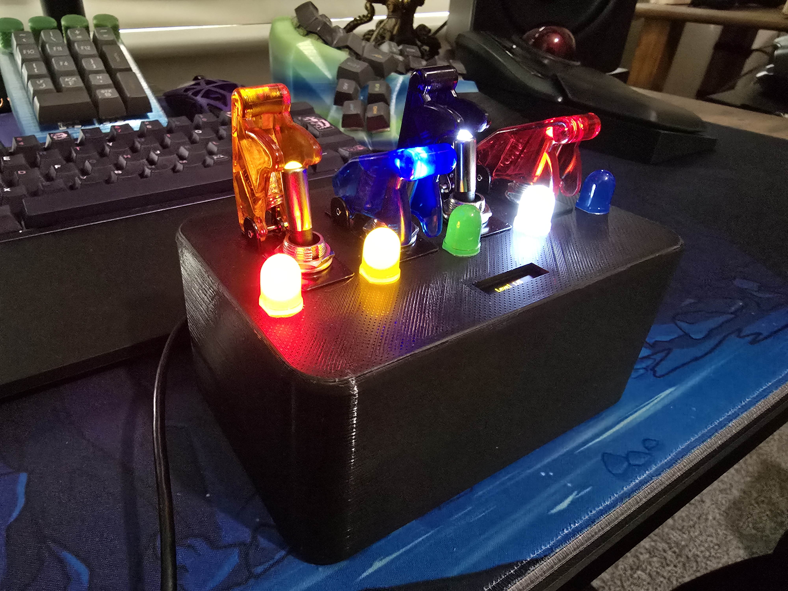
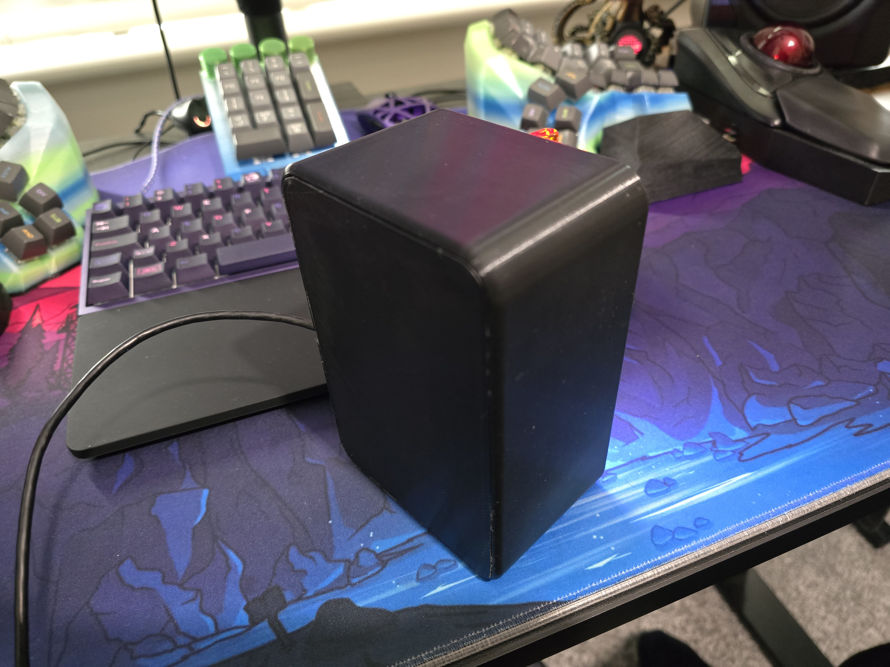

# Pico Switch Box

A fun little box for playing around with switches and leds.

Features a Game where you need to match the leds. You will be timed on how long it takes you to complete the game. By default there is only 5 levels but you can increase it to however many you want by changing `self.level_max = 5` inside `game.py`

Coming soon: control pc power button using a sequence.

The files I created for 3d printing are available inside the stl folder in this repo.

I was going to power it via a powerbank but since the pico draws barely any power the powerbank I have shuts off after 30 seconds. So I'm just going to power it via a usb port. Thats why you will see some extrusions in the 3d model for the power bank, you can remove those in blender to save some materials.


Top | Side | Bottom
:---:|:---:|:---:
 |  | 

# Hardware

All hardware is purchased from Aliexpress as its cheaper

1. Raspberry pi pico
2. 5 Big LEDs
3. 128x32 oled screen
4. 4 switch led combos
5. 9 325 ohm resistors
6. 4 10k ohm resistors
7. 8 small magnets

# Setup Software

Download and install Circuit python to the pico.

You will also need to download and copy some circtuit python libraries to the pico. Download the whole collection and then copy the following to the pico.

Also copy over the python files from this repo.
(can run copyToPico.sh/bat)

Your pico should look like this.

```
PICO
 | lib
    | adafruit_display_text
    | adafruit_hid
    | adafruit_displayio_ssd1306.mpy
    | adafruit_pixelbuf.mpy
    | neopixel.mpy
 | main.py
 | display.py
 | hardware.py
 | ledNormal.py
 | switchAndLed.py
 | hardware.py
 | tools.py
```

# Setup Hardware

For the display I use `i2c = busio.I2C(board.GP5, board.GP4)  # GP5 for SCL and GP4 for SDA` (see `display.py`). and the usual ground and power pins.

For the switches and leds see `hardware.py`.

The big normal leds are defined in `normalLedsPins = [board.GP16, board.GP17, board.GP18, board.GP19 ,board.GP20]`

The leds that are on the switches are defined in `switchLedPins = [board.GP15, board.GP14, board.GP13, board.GP12]`

The switch pins themselves for checking if the switch is closed or open are defined in `switchPins = [board.GP11, board.GP10, board.GP9, board.GP8]`


For led resistors I will use 325 ohm, for switch pulldown resistors I will use a 10k ohm.

### Notes on the switch and led combo component from aliexpress
```txt
[ground] [led] []
led is only on when switch is on..

[ground] [] [led]
led is always on...

ground seems to be only for the led. doesnt have any effect on the switch itself

switch only worksw with these two pins connected
[] [wire 1] [wire 2]


so to make both of them work switch will only be able to activate if the led is on.
So for led I will use this
[ground] [] [led]

then the pico can just listen on the middle pin


Wiring the switch will be as follows

[] [switch input] [led output]
       ^
       |
       10k ohm resistor
       |
       Ground


Wiring the switch leds will be as follows
[325 ohm resistor] [] [led output]
    ^
    |
    Ground
```

#### The wiring looks like this then

_ | _ | _
:---:|:---:|:---:
 |  | 


